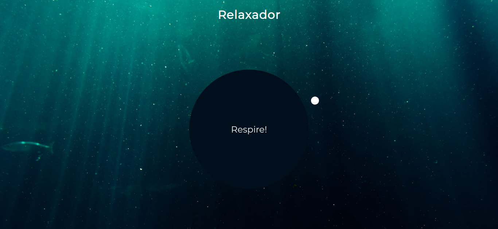

# relaxer-app

## Project

***EN:*** A relaxing breathing app with a visual director to tell you when to breathe in, hold and breathe out.

***PT-BR:*** Um aplicativo de respiração relaxante com uma diretriz visual para dizer quando inspirar, segurar e expirar.

## Specifications
- Create circle and gradient circle with CSS
- Create and animate pointer (Small circle)
- Create grow and shrink animations
- Add JavaScript to create the breath animation effect
***

## Technologies

This project was developed with the following technologies:

- HTML
- CSS
- JavaScript
***
 
## Preview

***

## License

This project is under the MIT license.
